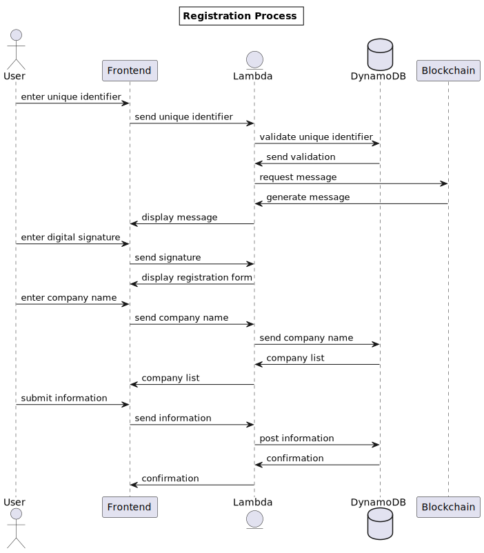

# Registration Design
This page explains the process being used to register employees and employers with for the Reputation Index. 
Users will need bitcoin core up and running for a successful registration, the link to bitcoin installation can be found
[here](https://github.com/davidseddy1/ReputationIndex/blob/4f5f81d87f1e8494fd63bd084a875df1c7bdf928/docs/userguide/employer-referral-user-guide.md)

## Front End Mockup

## Sequence Diagram

