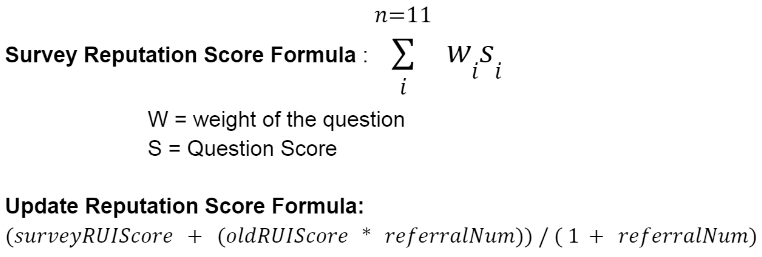

# Reputation Index Score Design

This page displays high level design content for the reputation index.

__Assumptions__:

* Loan applicant is registered
* Employer is registered
* Employer receives a referral link requesting them to complete survey

## Front-end Mock-up

CLick [here](./Referral_Form_Mockup.pdf) to see the mock-up with branding.

## Lambda Integration

The reputation score is calculated using a Lambda function.  Survey results from the front-end survey are passed in a json payload.  The survey reputation score is calculated.  After the score is calculated the Lambda function will update the applicants reputation score.

The incoming payload to the Lambda function is in a json format shown below.

    playload ={
        employer_id = 53465432031613,
        employer_id = 5461653213541,
            survey: {
                s_work_time: 4,
                s_pressure: 4,
                s_ethic: 4,
                s_complaints: 4,
                s_respect: 4,
                s_reliable: 4,
                s_task_time: 4,
                s_task_completion_time: 4,
                s_communicate: 4,
                s_experience: 4,
                s_fulltime: 4
            }
        submission_time: "2022-02-22T01:52:54Z"
    }

The psuedo code for the Lambda servless function is displayed below.

    score = 0;
    survey.map((question, q_score) => {
        score += weights[question] * q_score;
    });

    dynamodb.Referral.post(referral);

    employee = dynamo.Employee.query(employee_id);

    updated_score = (score + employee.score * employee.referral_nums) / (1 + employee.refrral_nums);

    updated_referral_nums = employee.referral_nums + 1

    dynamodb.Employee.update(employee_id, updated_score, updated_referral_nums, last_updated);

    blockchain.push(employee_id, updated_score, submission_time)
    

## Data Model

This section depicts the data model for the reputation index.  There are 3 tables used for storing referral data, loan applicant data, and employee data.  The data model records referral survey data linking it to the appropriate loan applicant and employer tables.

## Employer Table

+ __id__ is the primary key (Employer unique identifer)

## Employee Table
 

+ __id__ is the primary key (Employee unique identifier)

## Referral Table

+ __id__ is the primary key
+ __*employer_id and employee_id*__ are the foreign keys from the Employer and Employee table
