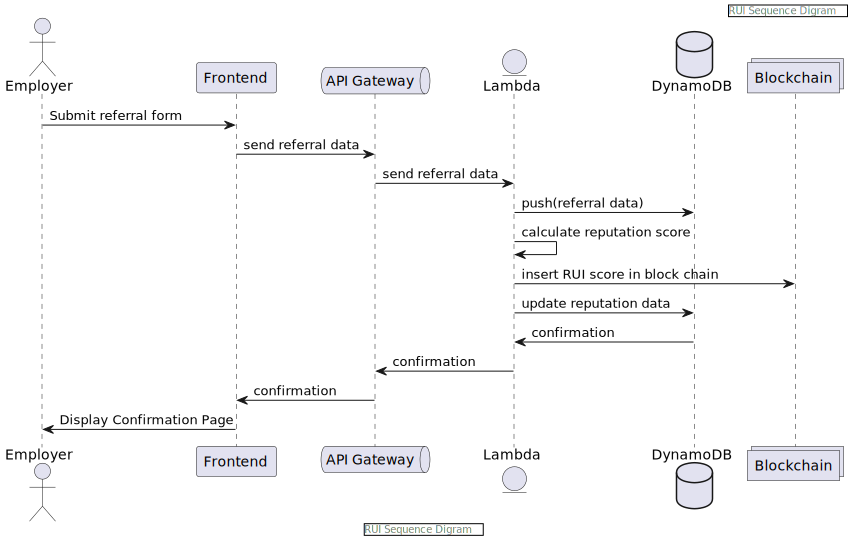
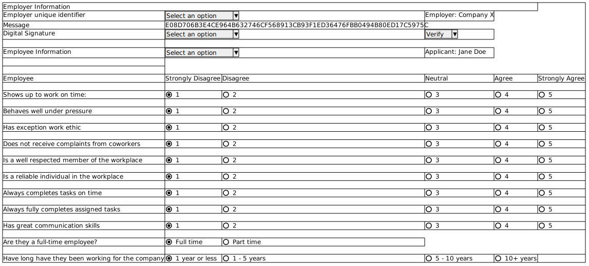
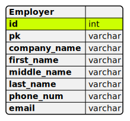
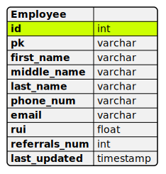
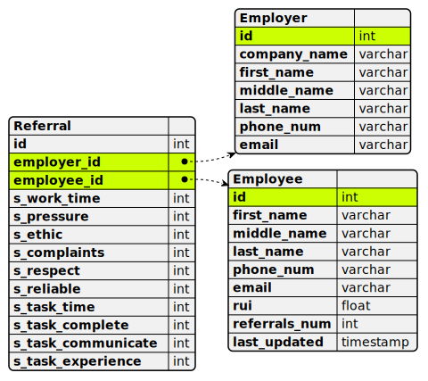

# Reputation Index Score Design

This page displays high level design content for the reputation index.
__Assumptions__:
* Loan applicant is registered
* Employer is registered
* Employer receives a referral link requesting them to complete survey

## Front-end Mock-up

CLick [here](./Referral_Form_Mockup.pdf) to see the mock-up with branding.

## Lambda Integration

## Data Model

This section depicts the data model for the reputation index.  There are 3 tables used for storing referral data, loan applicant data, and employee data.  The data model records referral survey data linking it to the appropriate loan applicant and employer tables.

## Employer table

+ __id__ is the primary key (Employer unique identifer)

## Employee table
 

+ __id__ is the primary key (Employee unique identifier)

## Referral

+ __id__ is the primary key
+ __*employer_id and employee_id*__ are the foreign keys from the Employer and Employee table
