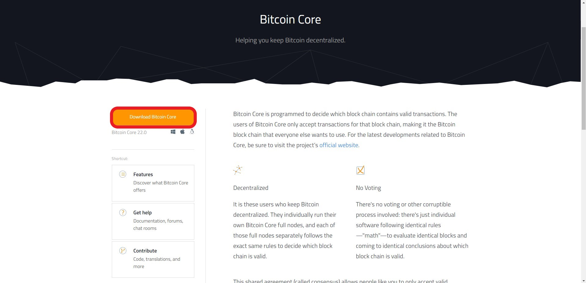
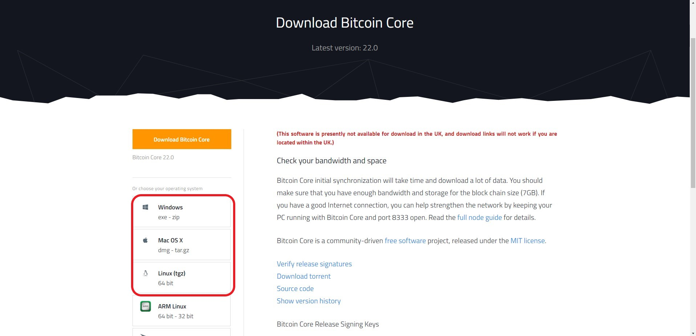
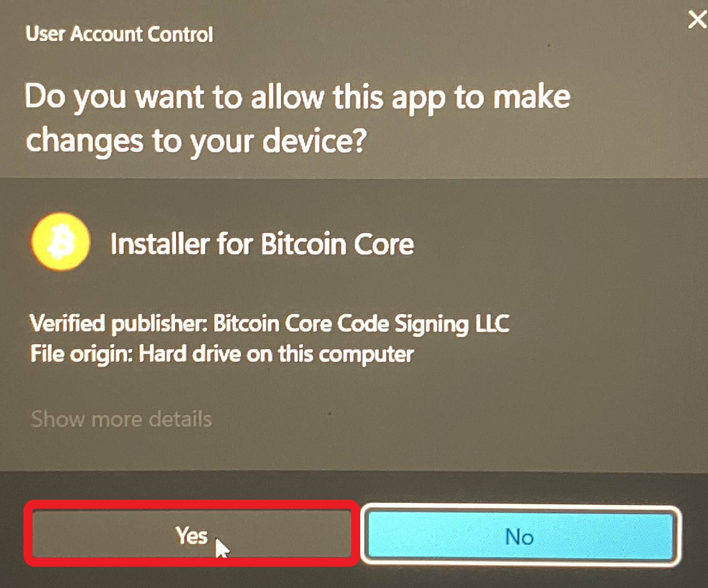
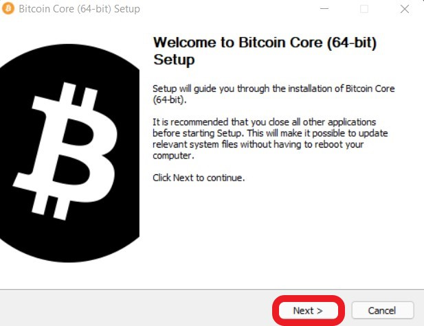
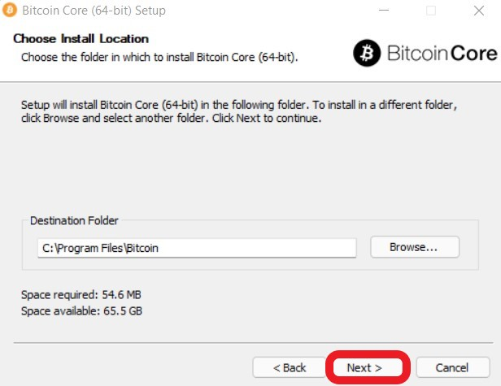
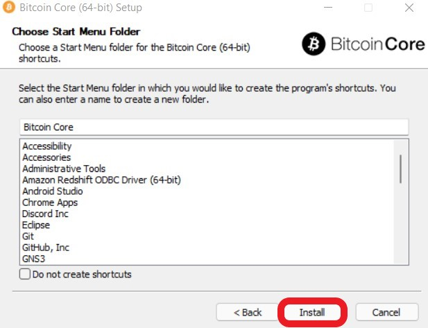
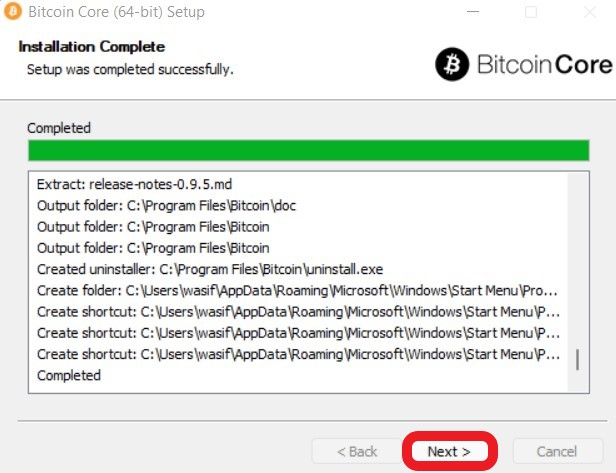
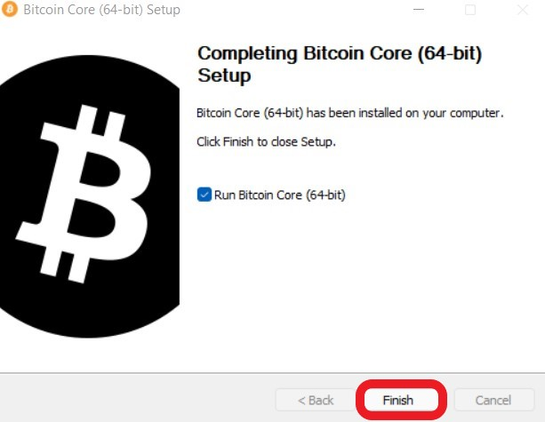
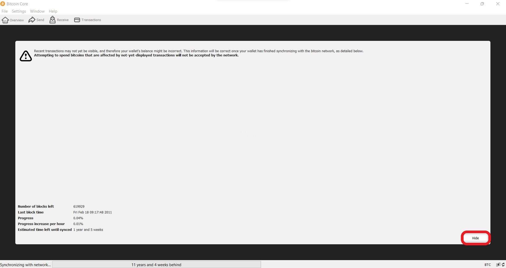
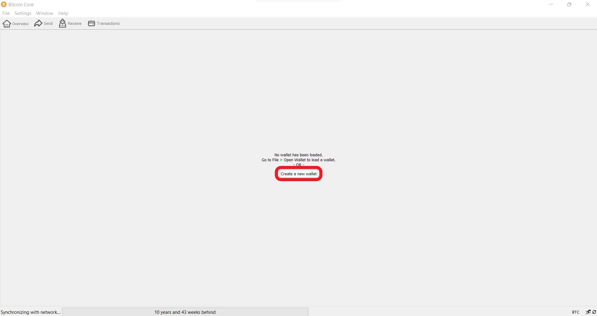

# Employer Referral User Guide

This guide is meant for employers planning to refer their current or former employees for a loan application at OtRL.

## Required materials
Employers must visit https://bitcoin.org/en/bitcoin-core/ in order to download and install Bitcoin Core on their windows or mac.

## Download and Install Bitcoin Core

1. Visit https://bitcoin.org/en/bitcoin-core/ and select the orange "Download Bitcoin Core" button.

2. Select the proper download for your operating system.

3. Double click the executable file in your downloads folder, then select “Yes” in the User Account Control Prompt.

4. Select “Next” on the prompt.

5. Select “Next” on the prompt.

6. Select “Install” on the prompt.

7. Select “Next” on the prompt.

8. Select “Finish” on the prompt.

## Start Bitcoin Core

9. Select “Hide” on startup of Bitcoin core if the following screen appears.
    - If the screen does not appear, continue to step 10.

10. Select “Create a new wallet”

