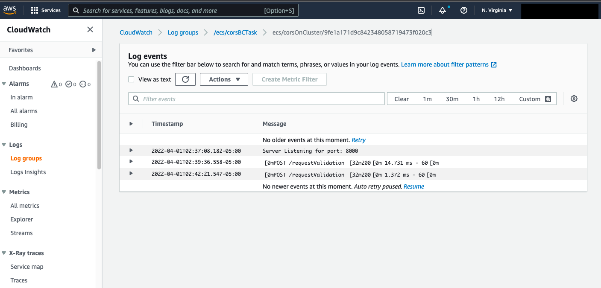

# Admin Guide

## Confirm DynamoDB Update
1. Open AWS and search for DynamoDB, select the first option

2. Select the "Tables" button in the leftmost navigation panel

3. Select the "referral" table from the existing tables

4. Select the "Explore More Items" button in the top right of the window

5. You can now see the updated referral items in the window.

## Confirm Blockchain Update
1. Go to the AWS Dashboard and search cloudwatch

2. Click on Log Groups on the CloudWatch Dashboard

3. Select the Desired Log Group named after the Task definition name

4. Select the newest logstream 
 

6. View the Logs for Blockchain

    - error code Post /requestValidation 200 -> Success
    - error code Post /requestValidation 404 -> Failure
    - error code Post /submt 200             -> Success
    - error code Post /submit 404            -> Failure
