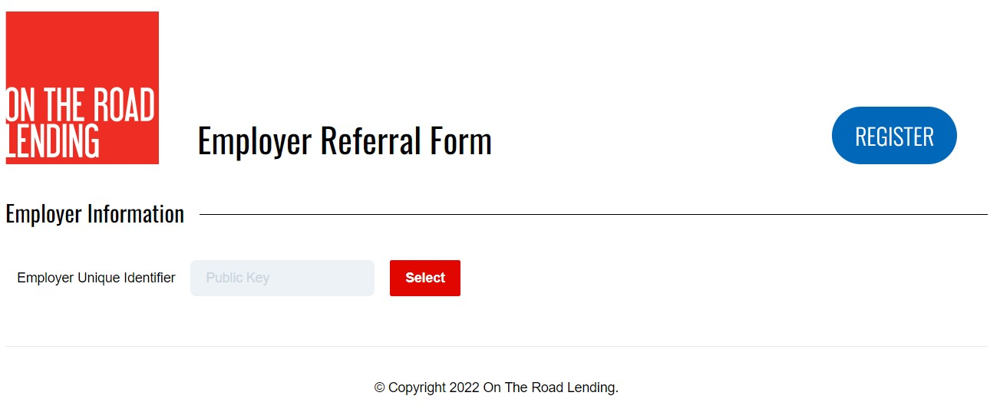
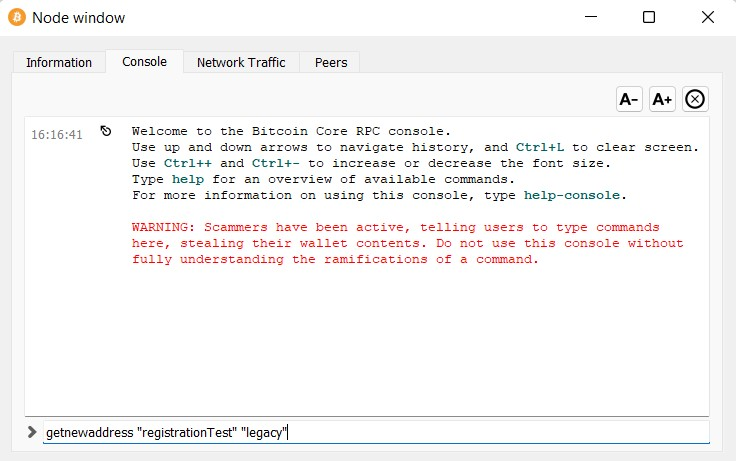
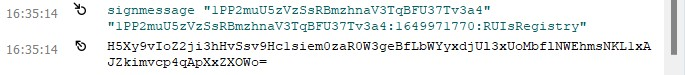
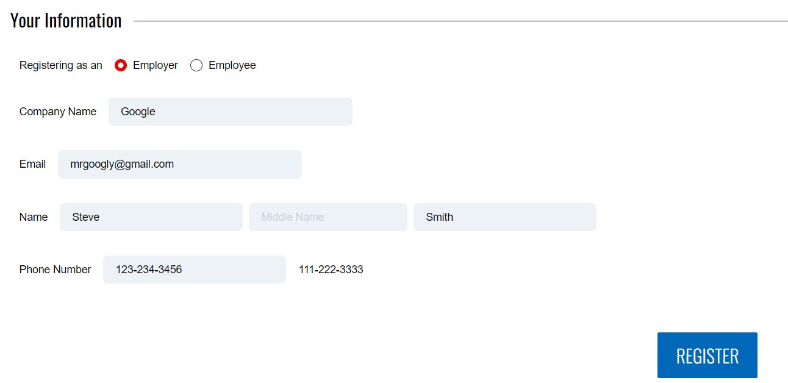
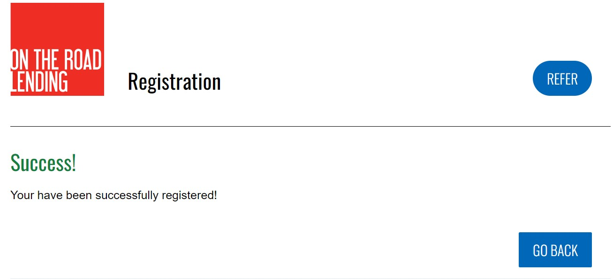

# Registration Guide

1. Go to the website link and select the "Register" button

2. Go to Bitcoin Core console 

3. Create a public key

4. Copy and paste the public key into the box and click Select.

5. Get the digital signature by typing into the Bitcoin console:
    signmessage "public key" "message"

6. Copy and paste the result into the Encrypted Message box and select Verify

7. Select whether you are registering as an Employer or Employee. 

8. Follow the instructions on the form and fill out the survey accordingly.

9. Select Register button at the bottom to submit your registration.

## Bitcoin Help
- For additional help with navigating Bitcoin Core and create a wallet, please refer to this guide: https://github.com/davidseddy1/ReputationIndex/blob/4f5f81d87f1e8494fd63bd084a875df1c7bdf928/docs/userguide/employer-referral-user-guide.md