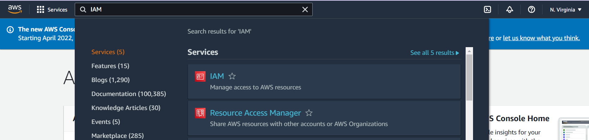
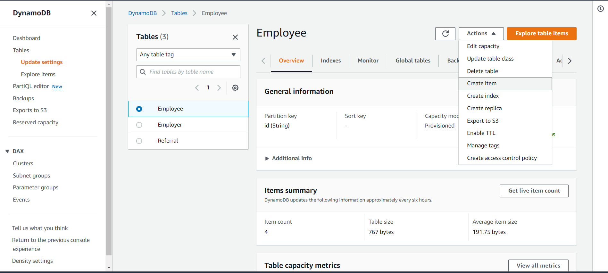
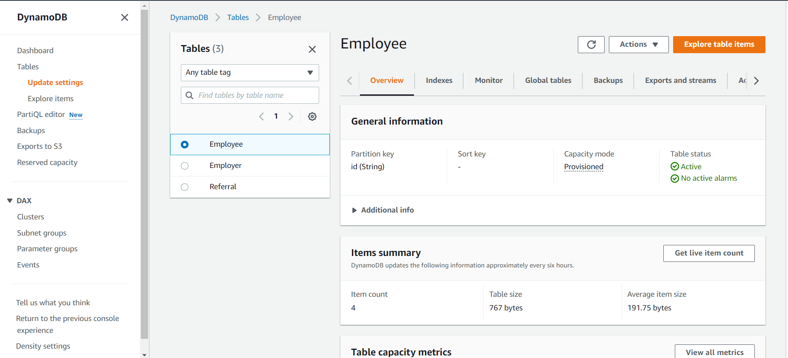
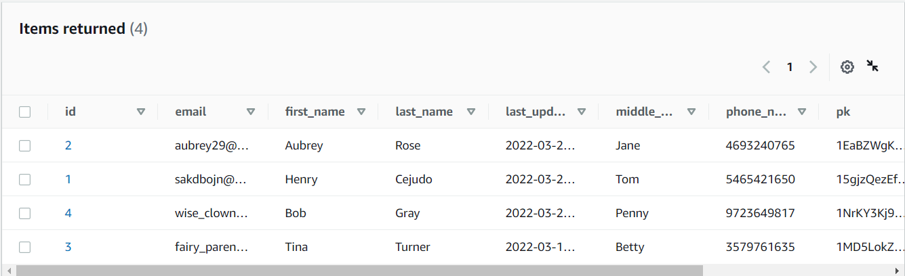
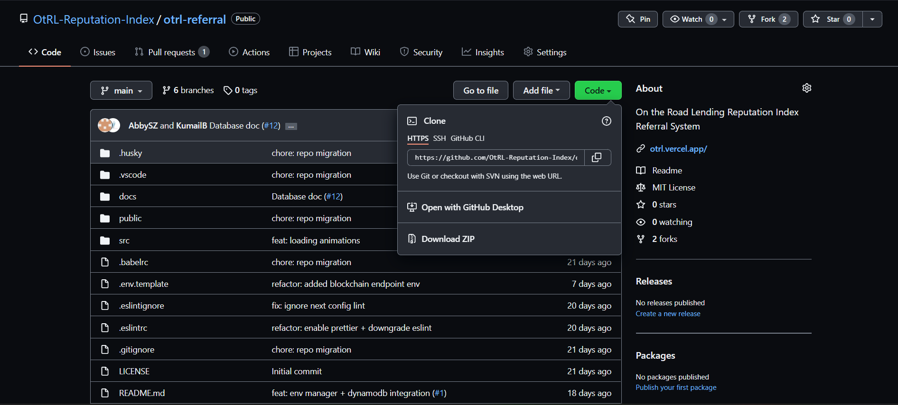

# Setting Up The Reputation Index Application

## Step 1: Set up AWS Account

#### Go to AWS Free Tier and create an account if you do not possess one already [https://aws.amazon.com/free](https://aws.amazon.com/free/?all-free-tier.sort-by=item.additionalFields.SortRank&all-free-tier.sort-order=asc&awsf.Free%20Tier%20Types=*all&awsf.Free%20Tier%20Categories=*all). 
Click on the orange "Create an AWS Account" Button at the top right of the screen.


Complete the steps prompted on the screen. Be aware that payment information will be asked for and have to be provided in order to use any of the services.


#### Set up an IAM User 
To be able to run the application fully an IAM User will need to be created. <br>
In the search bar look IAM. The following article will explain how to set up one up:[ https://docs.aws.amazon.com/IAM/latest/UserGuide](https://docs.aws.amazon.com/IAM/latest/UserGuide/getting-started_create-admin-group.html)
  

  
When selecting IAM it will take you to the dashboard, go to Users. Once there select the button "Add User".

  


The first page will ask for a name, it can be any name you want.


Adding Permissions is the next step.
Make sure to select FullAccess policies for DynamoDB, Amplify, ECS, EC2, ECR, and Lambda. The easiest way to do this is by using the policy administrationaccess.


The next step for user creation are tags. In this application it is not necessary. Continue to the next page which will have the user create button at the bottom. Click on the button, this will end the AWS account set up portion of the guide.


## Step 2: Creating The Database with DynamoDB

This step will walk you through how to create a database capitable with the application. There will be three tables involved: Referral, Employee, and Employer. In addition there will be a secondary global index  for Employee and Employer called pk-index. 

In the doc directory in the respitory [otrl_referral](https://github.com/OtRL-Reputation-Index/otrl-referral) there are JSON objects and a readme that tells how use AWS CLI to create the tables. The JSON objects that Items in the name will populate the tables with data, in those files it is dummy data.


This documentation will show how to set up the database using AWS DynamoDB website. For further information on DynamoDB set up the go to [https://docs.aws.amazon.com/amazondynamodb](https://docs.aws.amazon.com/amazondynamodb/latest/developerguide/GettingStartedDynamoDB.html)

### On the DynamoDB dashboard press the orange button that says  "Create table".


### Employee Table Set Up

For Employee table the partial key is a String id and there is no sort key. All the other settings are default so press "Create table" at the bottom of the page.


Now that the table is created go to the left side bar and press on Tables. This page will bring up all the tables that are created. 


Then click on Employee table, this will bring you to the Update settings page. Under Employee go to the Indexes tab and press on "Create index". This will be used to create the seconday global index that will help with searching using the public key (pk).


In partition key type pk for public key. The other settings should remian the default settings, ensure that auto-scaling is off. At the bottom create the key and this might take a while.


Once that is created it is time to add data to the table. Click on the upper right drop down button called Actions. Choose the "Create item" action. This adds data to the table.



The item will have the following attributes: id, email, first_name, last_name, last_updated, middle_name, phone_num, pk, referrals_num, and rui. The order they are added does not matter. To add attributes to this item click on "Add new attribute" and then select the data type for the attribute. Most of these will be strings except for referrals_num and rui which will be the datatype number.


To see what data is in the table on the Update settings page go to the upper right corner and click on the orange "Explore table items" button.



Scrolling slightly down will show Items returned box which shows all the items in the table.


Here is an example of an Employee table:




### Employer Table Set Up
This table will be created exactly like Employee was except the attributes for Employer items are: id, company_name, email, first_name, last_name, middle_name, phone_num and pk (pk stands for public key). All of these will be strings.


### Referral table Set Up
The partial key will be employee_id and the sort key will be employer_id. All the other settings are default so press "Create table" at the bottom of the page.


When a referral is submitted data like employee_id, employer_id, message, signature, submission time and the score from each question will be stored in the table. As shown below:


## Step 3: Setting up BlockChain
clone repository
```
git clone https://github.com/davidseddy1/PrivateBlockchain.git
cd BlockChainCode
```

After cloning the repository build
```
docker build -t imagename
```

Before logging into ecr, ensure that proper credentials are set up, the easiest policy to put in 
place is to give your self administrationaccess. After ensuring this please login to ecr. 

```
aws ecr get-login-password --region us-east-1 | docker login --username AWS --password-stdin ACCOUNTIDHERE!!!!.dkr.ecr.us-east-1.amazonaws.com
```

Go into AWS ECR console and select create new repository option
Ensure that Private repository option is picked and add the name of the repository to the end of the path. 

After this go back to the terminal to tag and push your image: 

```
docker tag imagename:latest YOURACCOUNT.dkr.ecr.us-east-1.amazonaws.com/AWSYOURREPO:YOURTAG
docker push YOURACCOUNT.dkr.ecr.us-east-1.amazonaws.com/YOURREPO:YOURTAG
```
Go into your repository, you should see the image, from there copy the image URI, this is needed for later. 


After this the terminal is no longer used. 
Go to ECS and select the cluster tab on the left hand side. 
**Create a new cluster**
- Choose EC2 Linux and Networking, select Next on the bottom
  - Pick a create a name for the cluster
  - Pick On Demand for Provisioning Model
  - EC2 Instance type choose the free tier option of t2.micro
  - AMI option choose the first option Amazon Linux 2
  - Leave the key-pair as none
  - VPC options choose default
  - Choose one of the subnets available 
  - Ensure that Auto-Assign IP address is enabled
  - Choose the default security groups
  - For container Instance IAM Role choose ecsinstancerole or if that is not available choose the create a new one
  - select create cluster, this will take a few minutes. 

**Create a Task Definition**
- On the left hand side choose Task Definition. 
- Select Create new TaskDefinition
  - Select EC2 tile on the bottom
  - Name your task definition
  - Select none for task role
  - leave network mode as default
  - Leave task memory and task cpu along
  - Choose add container under Container Definition
    -Type your container name
    -Paste the image URI which you saved earlier
    -Leave Private Repository authentication alone
    -Do your port mapping, in this case it will DesiredPort:8000, since 8000 is the container port
    -Choose Hard Limit 128 for Memory Limit
    -Select create task, don't bother with the advanced settings
    
**Add TaskDefinition to cluster**
- Go to your cluster, and choose the task tab
- Choose Run new Task
  - Choose EC2 as launch type
  - Select the task you just created for task name
  - choose your cluster
  - leave task number as 1
  - Leave task role as empty
  - Leave everything else as default, and run your task

**Go to your EC2 Instance**
- Go to security Group in the left hand side toward the bottom
- double click on the security group
- Select edit inbound group
  - Add a rule for custom TCP, Anwhere IPv4, for Port 8000
  - Add another rule which is also Custom TCP, Anywhere IPv6, for port 8000
- Now exit and Select Edit Outbound group
  - Add the same rules that are for inbound rules

Go back to the EC2 instance and go to overview detail
- There you should see on the right public IPv4 DNS
- Copy this address, and go to your web browser
- Paste the public IPv4 DNS address and at the end add :8000
- You should see a Get/ Request could not be found
  - This means that everything has been set up correctly.

For a visual Demonstration on how to set up blockchain on AWS, please refer to:
- [Visual BlockChain AWS setup](https://www.youtube.com/watch?v=zs3tyVgiBQQ)


In your browser type the URL: http://localhost:30000 to run the application.

## Step 4: Amplify

The the following link goes into greater detail and background on setting up the github on Amplify: [(https://docs.aws.amazon.com/amplify](https://docs.aws.amazon.com/amplify/latest/userguide/getting-started.html).

Pressing the Get Started orange button will lead you to the bottom of the page.


 
Select "Get Started" under "Amplify Hosting".


The first step is to choose where the pre-existing code is coming from. Since the code is coming from the [otrl-referral github](https://github.com/OtRL-Reputation-Index/otrl-referral) the Github option will be picked.


Press Next and in the next page it will ask for the github repository. The link for the repository can be found under Code at: [otrl-referral github](https://github.com/OtRL-Reputation-Index/otrl-referral).

For reference the link is: https://github.com/OtRL-Reputation-Index/otrl-referral.git



Once it has the link it will ask you to choose a branch so select the main branch.


Next page is configuration. What will be added on this page will be the environemnt variables which occur in the advanced section of the page. Note that for BlockChain-URL the one in the example is a temporary solution that will be explained later in the this step.


#### Service Role
Service role in the configuration are meant to allow amplify to access other services on your behalf.So to create one click on "Create new role".


Click on AWS service, and then choose AdministratorAccess-Amplify. Continue to press next at the bottom until the create role button appears at the bottom.


Once it is successfully created refresh the roles on the configuration page and use the drop down to select the new role.


#### Environment Variables

To make it more clear what the enviorment variables here is an image with a more clear listing. To get to this page after creating the app it will be in App Settings on the left under Environment variables.


##### BLOCKCHAIN-URL:
this will come from EC2. There will be some security issue with the browser so the temporary work around is to use cors-anywhere. Which will be done by going to the github: https://github.com/Rob--W/cors-anywhere#demo-server, and requesting access to the demo on the link: https://cors-anywhere.herokuapp.com/.

Once the request has been granted then https://cors-anywhere.herokuapp.com/ goes infront of the blockchain URL from EC2 which will be something like: ec2-54-145-6-33.compute-1.amazonaws.com:8000

##### DB_AWS_ACCESS_KEY and DB_AWS_SECRET_KEY:
These come from the IAM User set up in step 1.

##### DB_AWS_REGION
This will be the closest region to you, which can be see at the top of the page near your user name.


##### NEXTJS_URL
This will be http://localhost:3000

##### __LIVE_UPDATES__
This will be [{"pkg":"next-version","type":"internal","version":"latest"}]

After configuration click next and it will bring you to the Review page. This will deploy the app, which can take up to 10 minutes for it to completely deploy.


When all the circles are green with check marks then that will mark it as beig successfully deployed.


 
Click on main which will bring you to a page that will have the URL.


Clicking on the domain URL will bring you to the website.


## Additional Comments

### Changing Weights of questions

The weights for the survey questions are in a javascript object. Which is found in the file weights.ts in the [otrl-reputation-index github](https://github.com/OtRL-Reputation-Index/otrl-referral/blob/main/src/pages/api/weights.ts). It can be accessed by going src >> pages >> api >> weights.ts To change the value just change the number next to the question.


