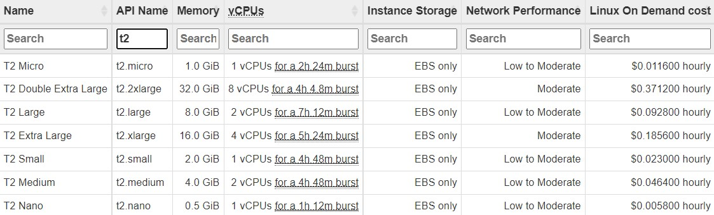

# Cost to Run Project

Here's the pricing chart for the T3 instances for ECC:

For our project, we are mainly using the US-East-1 (N. Virginia) region. Note that only US regions should be enabled for this project as it is much cheaper than global regions. During the time of us utilizing AWS, we were mainly billed for Elastic Compute Cloud (ECC). ECC has many instances that can be used, but T3 instances satisfy the needs of running the project. T3 instances are the low cost burstable general purpose instance types that provide a baseline level of CPU performance with the ability to burst CPU usage at any time for as long as required. 

- Minimum cost:
    We currently do not have a lot of data in the project so specifically the t3a.micro API has been used which gives us 1 GiB of memory. With the on demand option, the cost is $0.0094/hour. Considering the scenario of this project being run for 24 hours a day, the monthly cost would be just $6.77 or an annual cost of $81.24.

- Maximum cost:
    As the project grows and more data is needed, AWS’ largest instance, t3a.2xlarge, could be utilized. As shown in the chart, the 2x-large instance has a maximum memory capacity of 32 GiB.This is the most expensive instance per hour with a cost of $0.3008 hourly. Running with this instance would cost $216.58 monthly or an annual cost of $2,598.91. 

