# Employer Referral User Guide

This guide is meant for employers planning to refer their current or former employees for a loan application at OtRL.

## Required materials
Employers must visit https://bitcoin.org/en/bitcoin-core/ in order to download and install Bitcoin Core on their windows or mac.

## Download and Install Bitcoin Core

1. Visit https://bitcoin.org/en/bitcoin-core/ and select the orange "Download Bitcoin Core" button.

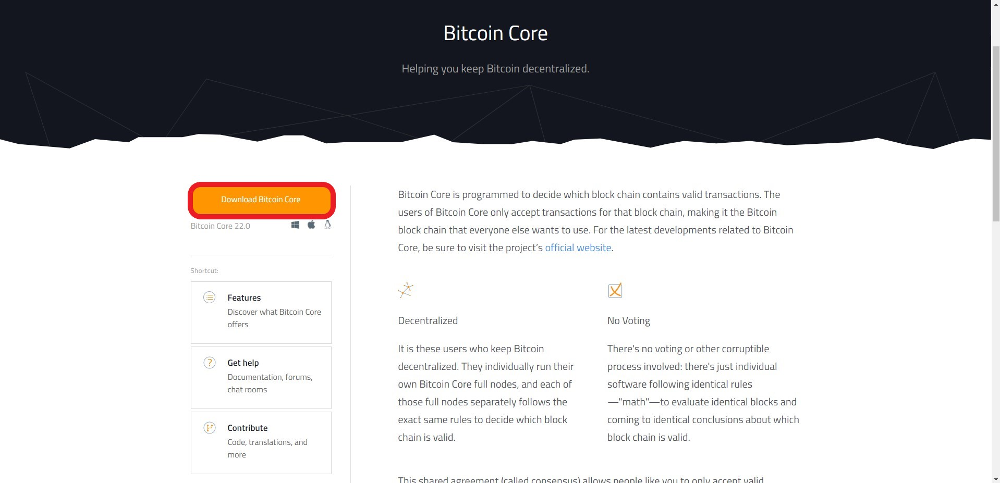

2. Select the proper download for your operating system.

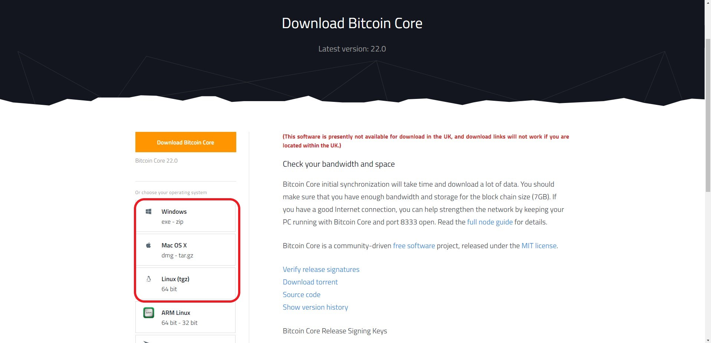

3. Double click the executable file in your downloads folder, then select “Yes” in the User Account Control Prompt.

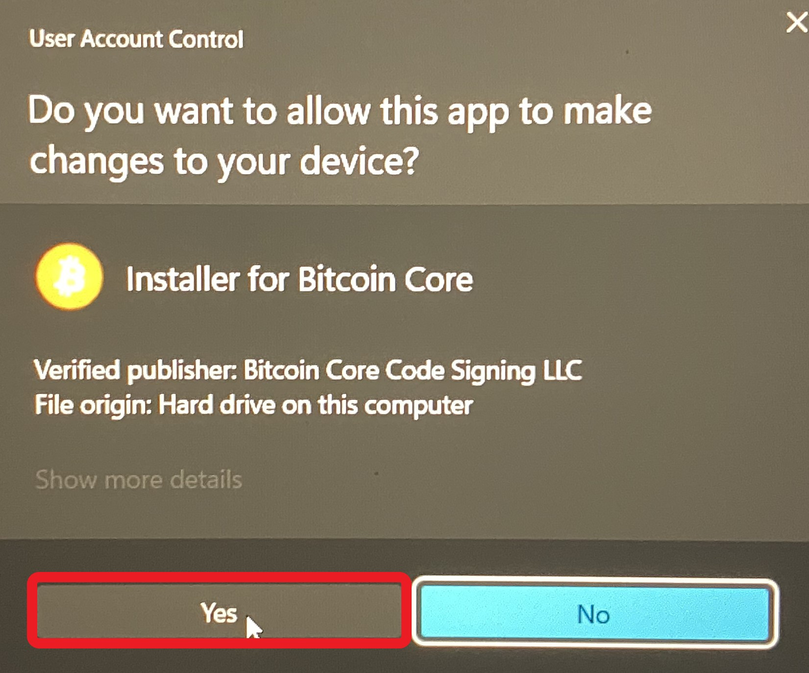

4. Select “Next” on the prompt.

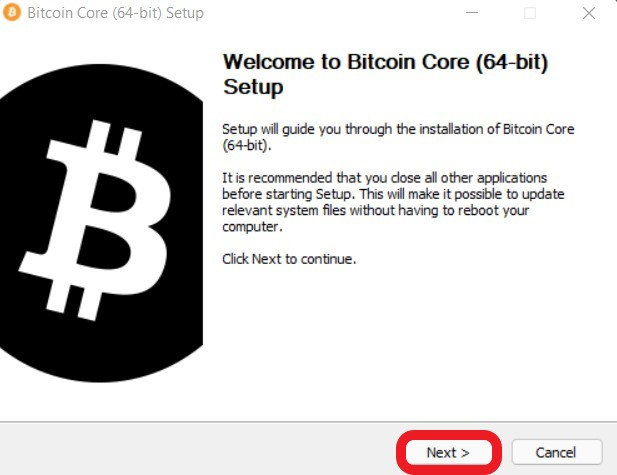

5. Select “Next” on the prompt.

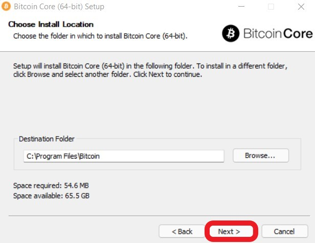

6. Select “Install” on the prompt.

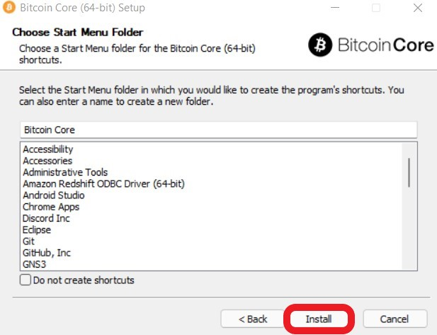

7. Select “Next” on the prompt.

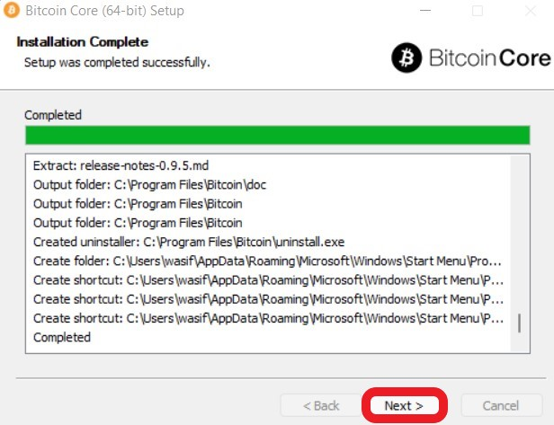

8. Select “Finish” on the prompt.

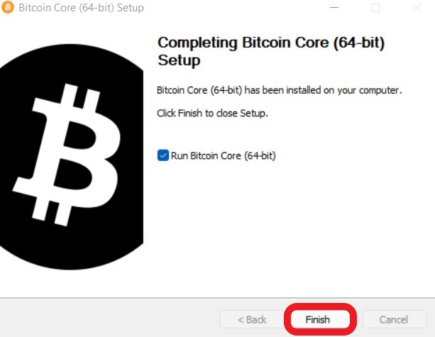

## Start Bitcoin Core

9. Select “Hide” on startup of Bitcoin core if the following screen appears.
    - If the screen does not appear, continue to step 10.

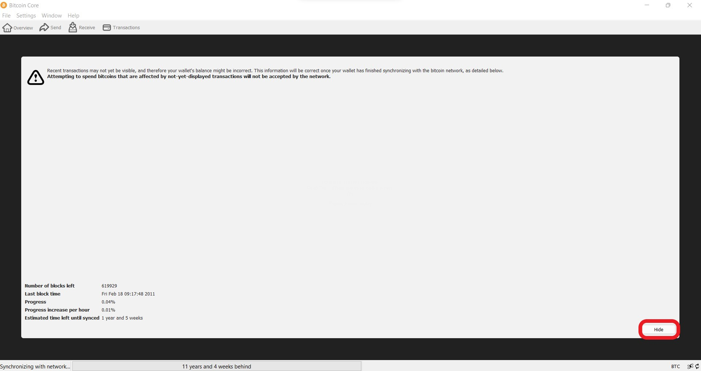

10. Select “Create a new wallet”

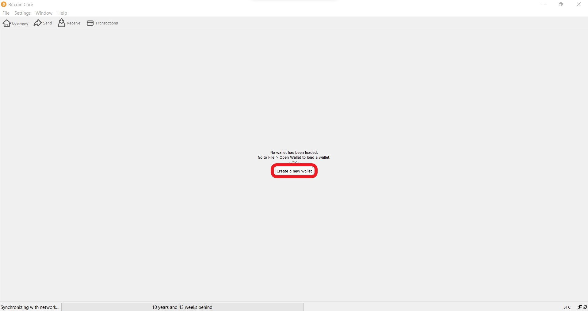

11. Name the wallet with your desired name and select create.

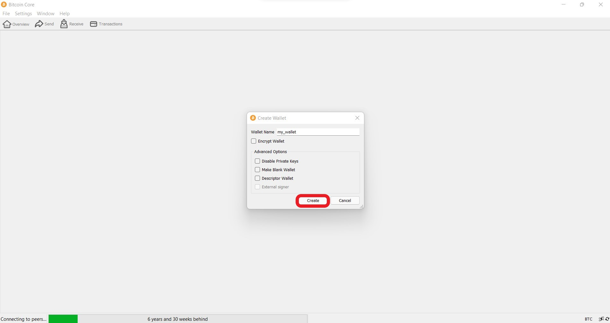

12. Select "Window"

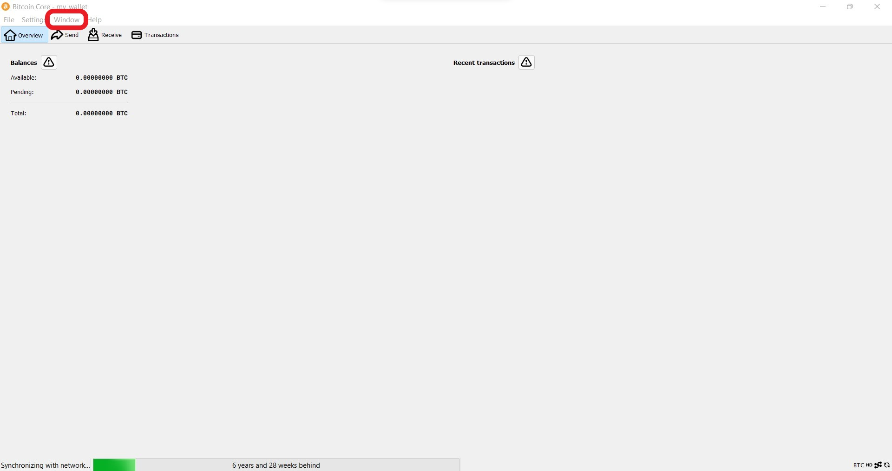

13. Select "Console" in the drop down.

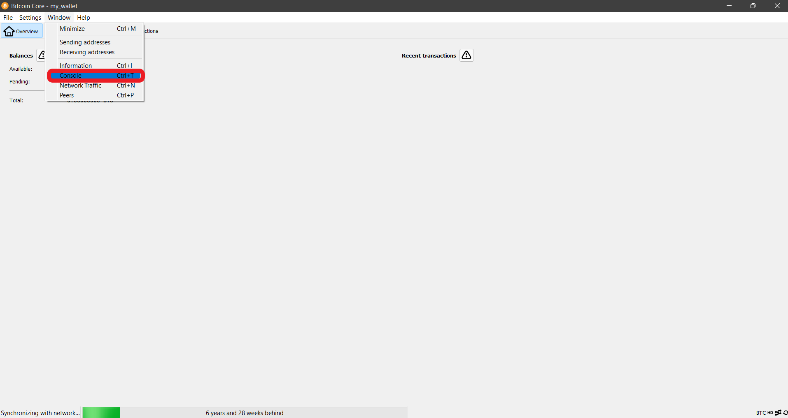

14. Type "getnewaddress 'companyName_public_key' 'legacy'" to produce a public key for your company
    - Note: Your public key may be registered with OtRL, please skip this step if you have an existing public key.

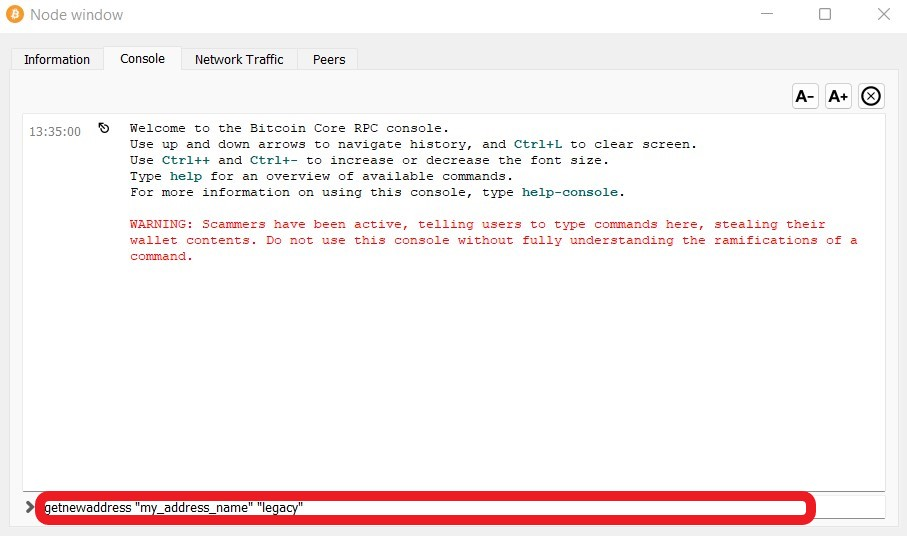

15. Copy the address/public_key provided by the console.

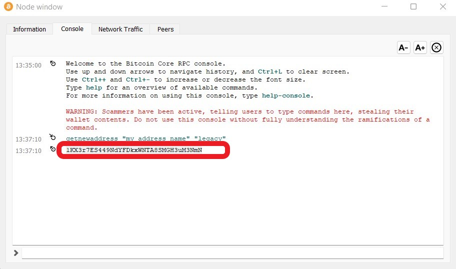

## Using Bitcoin Core with the Employee Referral Form
This section will require both Bitcoin Core and the Employee Referral Form to be open on your device. Consecutive steps may jump from the Employee Referral Form to the Bitcoin Core application.

16. Navigate to [Referral form](https://main.d2qwhcudgunbox.amplifyapp.com) 

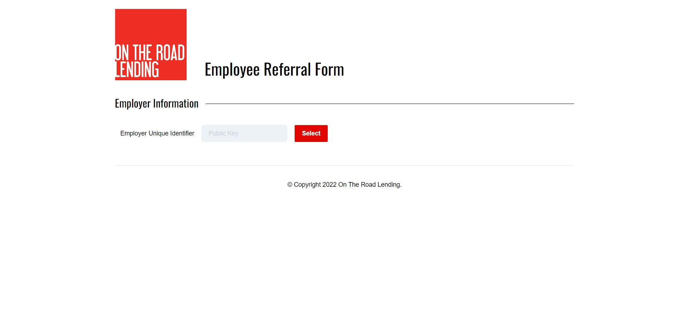

17. Paste the address/public_key into the Employer Identification Field and click "select," your company name should appear on the right hand side and a message should appear below.
    - Copy the message and keep it on hand, it may be helpful to paste it somewhere you can recopy it.

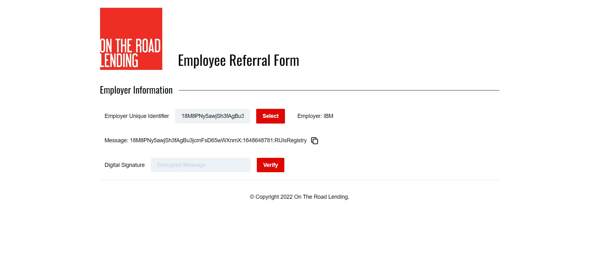

18. Navigate to the Bitcoin core console to sign the message

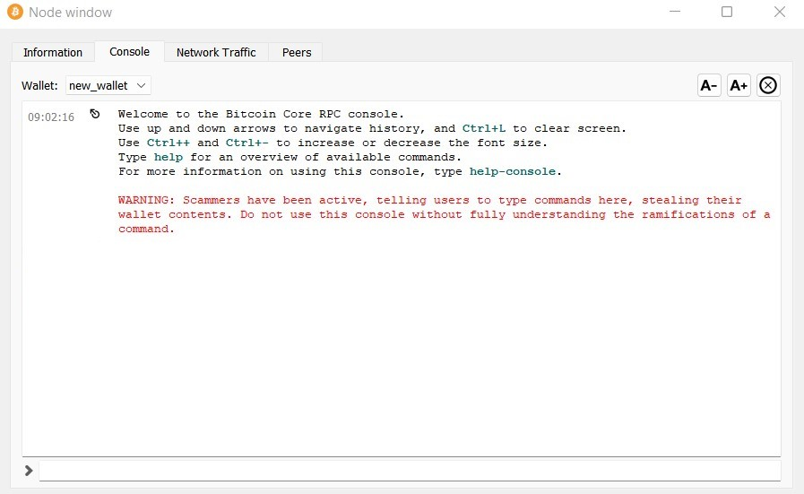

19. In the console type dumpprivkey followed by your address in quotation marks:
    - EX: dumpprivkey "public_key/address"
    - The output is your private key, copy your private key

  
20. In the console, proceed to type signmessagewithprivkey followed by your private key in quotation marks and the message in quotation marks:
    - EX: signmessagewithprivkey "private_key" "message"
    - The output is your digital signature will be produced, copy the digital signature

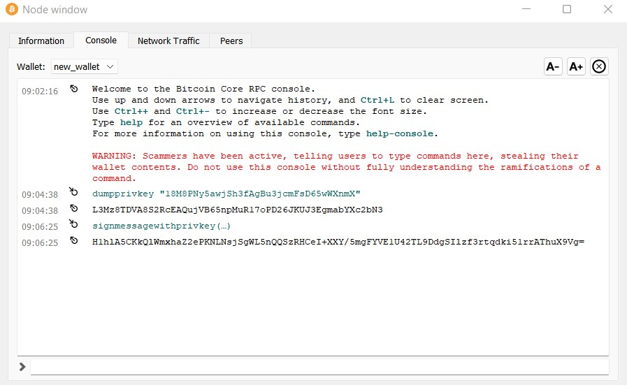
 
24. Navigate back to the Referral form and paste the signature in the text box next to digital signature, click "select"
    -  You should now be able to see the next field "Employee Unique Identifier"

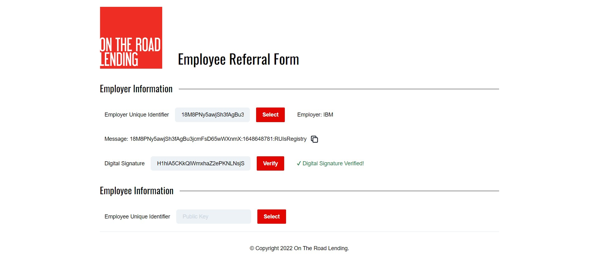

25. Now enter the Employee Unique Identifier for the employee you plan to refer, then click "select"
    - You should now see the employee name and the referral form should have become visible. Follow the instructions on the form and fill out the survey accordingly.

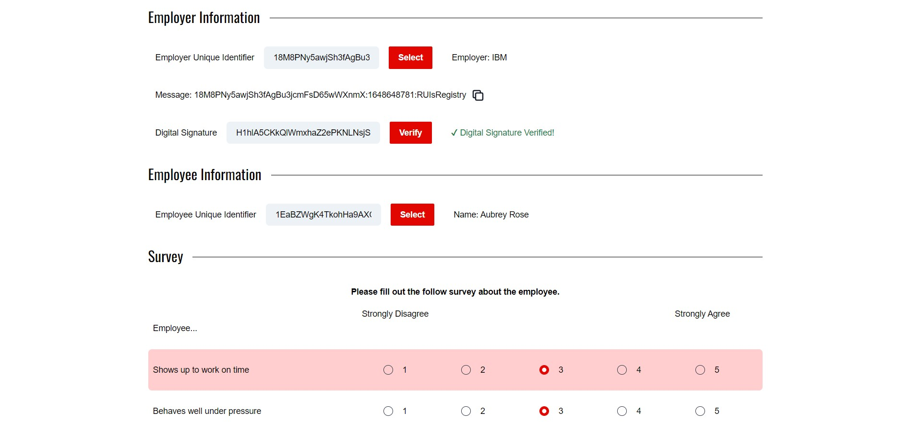

27. Once you have finished the form, click "Submit"
    - You will see the following screen after a successful submission.
 
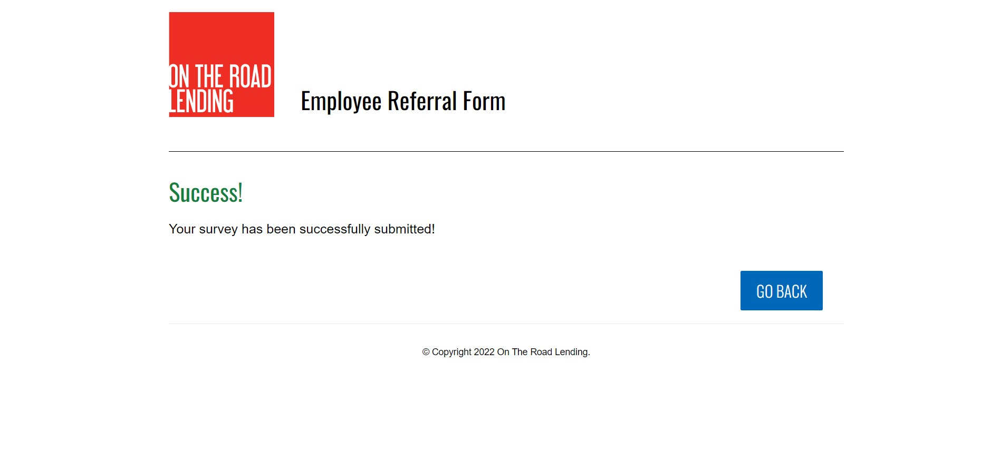
