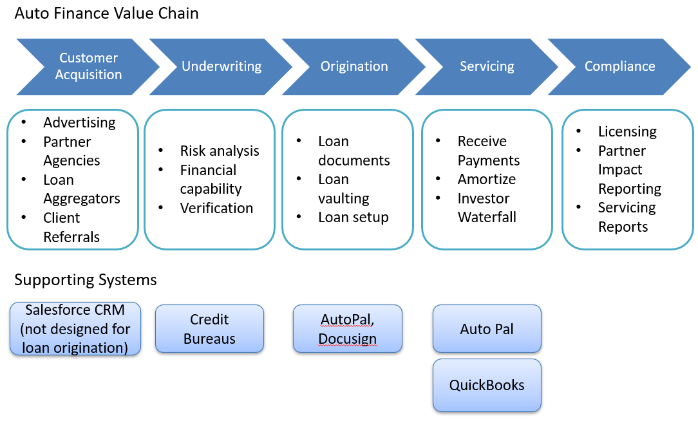
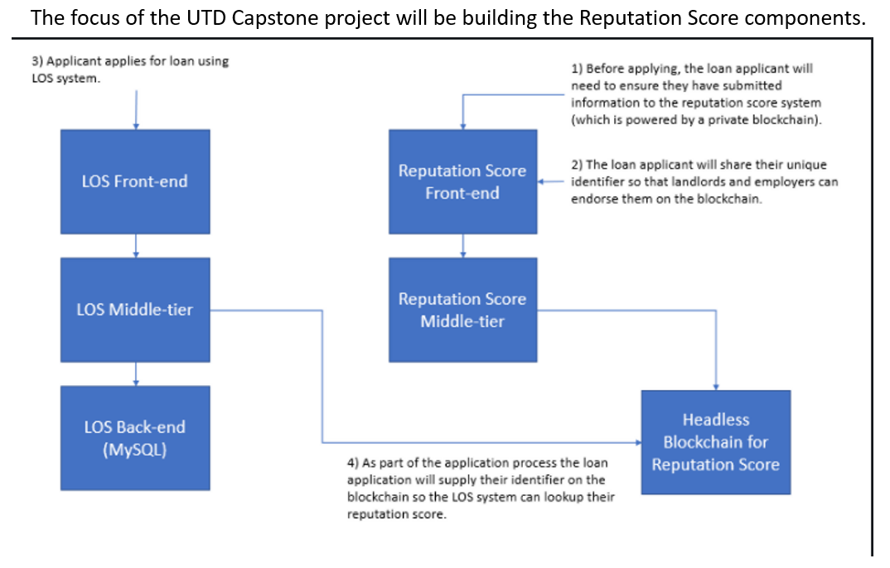
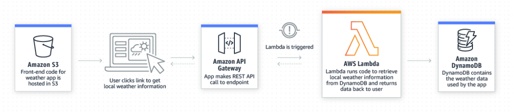
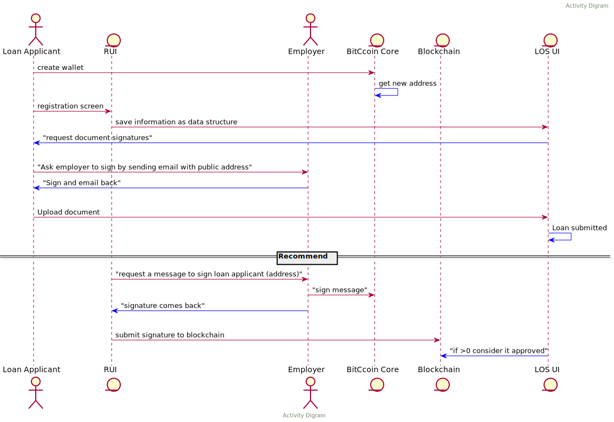

## Reputation Score

Your reputation score represents the total value of your online and offline relationships.  Its based on feedback on your relationships with your employer, landlord, mentors, and others who've established a relationship with you.

## Full Blockchain Scope Considerations

* Customers register and establish identity within blockchain via mobile app
* Systems supports loan application process
* Integration with Document Management Solutions
  * Save the loan application 
  * Support digital signature
* VIN/Asset Management
  * Vehicle Identity Stored on chain
  * Associated with Loan
* Payment Processing (with crypto)
* Crypto asset backing the loan
* Smart contract linking the loan to the asset
* Payments made into a wallet address associated with the smart contract

## Required Skills

* Demonstrated Interest in Blockchain Development.  (No skills required at the start.  The existing prototype of the private blockchain is written in Node.js)

* Knowledge of source control management software.  For this project we'll utilize GitHub using a [feature branch workflow](https://www.atlassian.com/git/tutorials/comparing-workflows/feature-branch-workflow).
  * Learn more about GitHub by visiting [GitHub Learning Lab](https://lab.github.com/)

* General knowledge of [Node.js](https://nodejs.org/en/).

* General willingness to learn [AWS Lambda architecture](https://aws.amazon.com/lambda/?trkCampaign=acq_paid_search_brand&sc_channel=ps&sc_campaign=acquisition_US&sc_publisher=Bing&sc_category=Cloud%20Computing&sc_country=US&sc_geo=NAMER&sc_outcome=acq&sc_detail=%2Baws%20%2Bcloud%20%2Bservice&sc_content=Cloud%20Compute_bmm&sc_matchtype=p&sc_segment=&sc_medium=ACQ-P|PS-BI|Brand|Desktop|SU|Cloud%20Computing|Solution|US|EN|Sitelink&s_kwcid=AL!4422!10!71605848472438!71606291145655&s_kwcid=AL!4422!10!71605848472438!71606291145655&ef_id=23c34c7ad0cc106db87f2d9707c298ba:G:s)

## Workflow

## Skill to be Developer

* The UI components are developed with react.js
* The UI is deploy on AWS
* Some experiences in these area will be helpful but not required.

